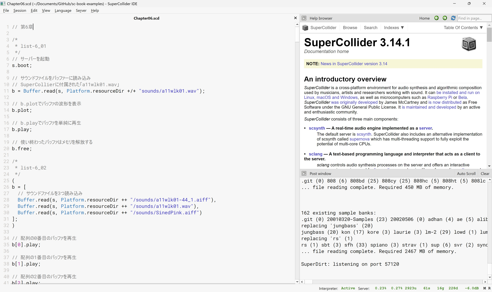
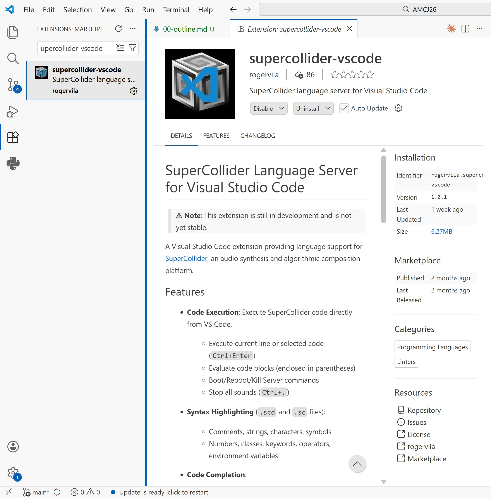
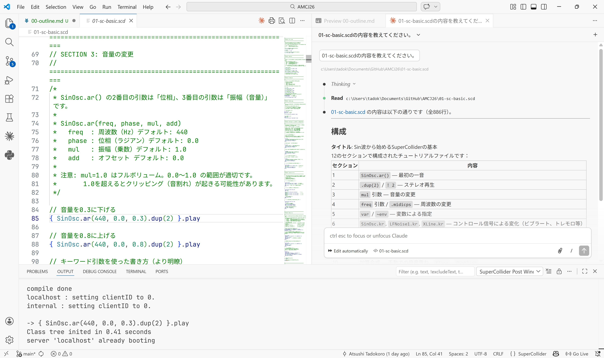
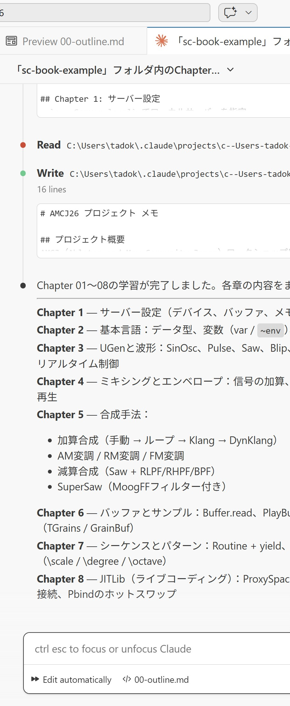

<style>
section {
  font-family: 'Hiragino Sans W4';
  color: #444;
  font-size: 24px;
}
b, strong {
  font-family: 'Hiragino Sans W7';
}
ol {
  list-style-type: decimal;
}
h1, h2, h3, h4, h5, h6{
  font-family: 'Hiragino Sans W7';
  color: #2277cc;
}
pre, code {
  font-family: 'JetBrains Mono Slashed', 'Noto Sans JP';
  line-height: 1.3;
}
</style>

##### AMCJワークショップ<br>共鳴するコード、SuperColliderで創る音の世界 - 実践とその先へ

# 00.<br>導入: ワークショップのための環境設定

2026年3月14日
田所淳

---


## 本日のワークショップの内容

書籍「共鳴するコード、SuperColliderで創る音の世界」のさらに先を紹介!

もちろん、SuperColliderの初歩からカバーしていきます。

---

## 本日のワークショップの内容

00. 導入: ワークショップのための環境設定
01. 準備体操: SuperColliderのおさらい - Sin波からはじめるサウンドプログラミング
02. その先 1: SuperCollider + VSCodeでVibe Coding!
03. その先 2: Strudel + SuperColliderでLive Coding!
04. その先 3: Super Sonic - WebブラウザーでSuperColliderを動かす!

---

## 環境設定

必要なアプリケーションをまずはインストールしていきましょう!


macOS / Windows どちらでもOK
- [SuperCollider](https://supercollider.github.io/)
- [VScode](https://code.visualstudio.com/)
- [Google Chrome](https://www.google.co.jp/chrome/)

---

## 環境設定


本日のワークショップでは、コード生成のAIのアカウントがあるとなお便利です!

- [Claude Code](https://code.claude.com/)
- [Github Copilot](https://github.com/features/copilot)
- [Gemini Code Assist](https://codeassist.google/)
- [ChatGPT codex](https://chatgpt.com/codex)

---

## SuperCollider IDEの基本をおさらい

画面を操作しながら解説していきます。



---

## SuperCollider IDEの基本をおさらい

サーバー (scsynth) とクライアント (sclang) と開発環境 (IDE) の関係


---

# 本日の「その先」: 1<br>VScodeからSuperColliderを使う

---

## VScodeからSuperColliderを使う

SuperCollider IDEをVSCodeに置き換える


---

## VScodeからSuperColliderを使う


SC IDEは便利ですが、VScodeを使用するとさらに様々なメリットが

- コード補完
- シンタックスハイライト
- Git連携
- **AIコード生成ツールとの連携 ← !!**

---

## VScodeからSuperColliderを使う

VScode用のSuperColliderの拡張機能、
これまでもいくつか存在していた (ややこしい…)

- [vscode-supercollider](https://marketplace.visualstudio.com/items?itemName=jatinchowdhury18.vscode-supercollider): Language support for the SuperCollider language
- [language-supercollider](https://marketplace.visualstudio.com/items?itemName=salkin-mada.language-supercollider): SuperCollider syntax grammars for VSCode
- [scvsc](https://marketplace.visualstudio.com/items?itemName=scvsc.scvsc): vscode as a supercollider client

しかし、どれも一長一短
更新が止まっていたり、インストールが複雑だったり…


---

## VScodeからSuperColliderを使う

しかし、最近新しい拡張機能が登場! とても便利、かつインストールが (比較的) 簡単!

**[supercollider-vscode](https://marketplace.visualstudio.com/items?itemName=rogervila.supercollider-vscode)**  ([github](https://github.com/rogervila/supercollider-vscode))
SuperCollider language server for Visual Studio Code


- コード実行
- シンタックスハイライト
- コード補完
- エディター機能

---

## VScodeからSuperColliderを使う



- VScodeの拡張機能
- “supercollider-vscode” で検索
- インストール

---

## VScodeからSuperColliderを使う

環境設定: 以下のように、SuperColliderの言語であるsclangへのパスを通す必要があります。

**macOS**: 以下の記述を ~/.zshrc に追加

```bash
export PATH="$PATH:/Applications/SuperCollider.app/Contents/MacOS"
```

**Windows**: 環境変数のPATHに以下を追加

```powershell
C:\Program Files\SuperCollider-3.14.1
```

---

## VScodeからSuperColliderを使う

確認: 以下のコマンドがターミナルで実行できるか確認

**MacOS**: Terminal.appを開いて、以下のコマンドを実行

```bash
% sclang
```

**Windows**: PowerShellを開いて、以下のコマンドを実行

```powershell
> sclang
```

---

## VScodeからSuperColliderを使う

VScodeにはSuperCollider IDEのようなHelp Browserは無い
→ 公式ドキュメントのWeb版を活用しましょう!

- https://doc.sccode.org/

IDEのHelp Browserの中身と同じ内容がWeb上で閲覧できます。

---

## AIコード生成を活用しながらSuperColliderをコーディング!!<br>最強の環境が実現しました!!



---

## 本日の「その先」の内容

- SuperColliderの基本をおさらい - 初歩からステップバイステップで
- 「その先」1: SuperColliderでvibe coding! - AIコード生成ツールを活用
- 「その先」2: Strudel + SuperColliderでライブコーディング!
- 「その先」3: WebブラウザーでSuperColliderを動かす! Super Sonic

---

## ウォーミングアップ



以下のGithubリポジトリをZipでダウンロード
https://github.com/tado/AMCJ26

(もしAIエージェントが使用できる方は) 以下のプロンプトでAIを賢くしておきましょう!

  > 「sc-book-examples」フォルダ内のChapter01からChapter08のSuperColliderのファイルの内容を学習してください。

---

## それでは、SuperColliderの「その先」の世界へ<br>飛び込んでいきましょう!
