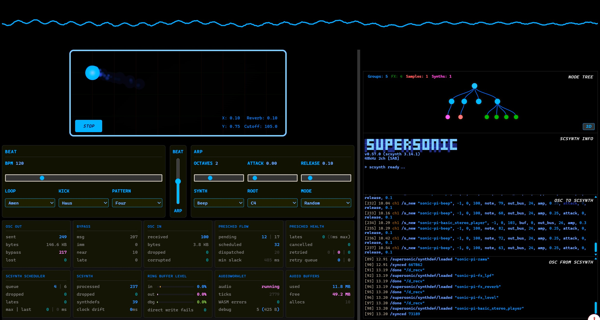
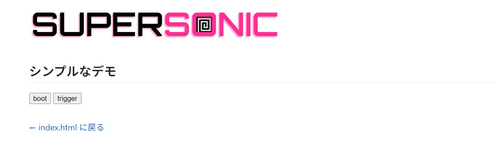
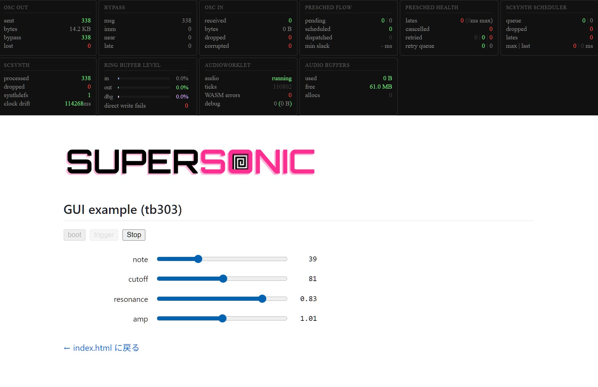
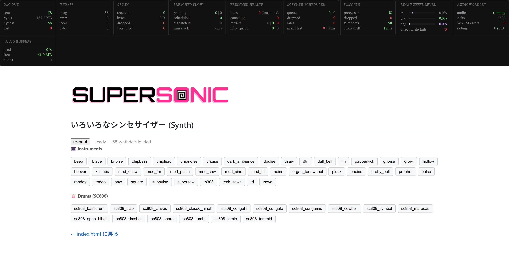
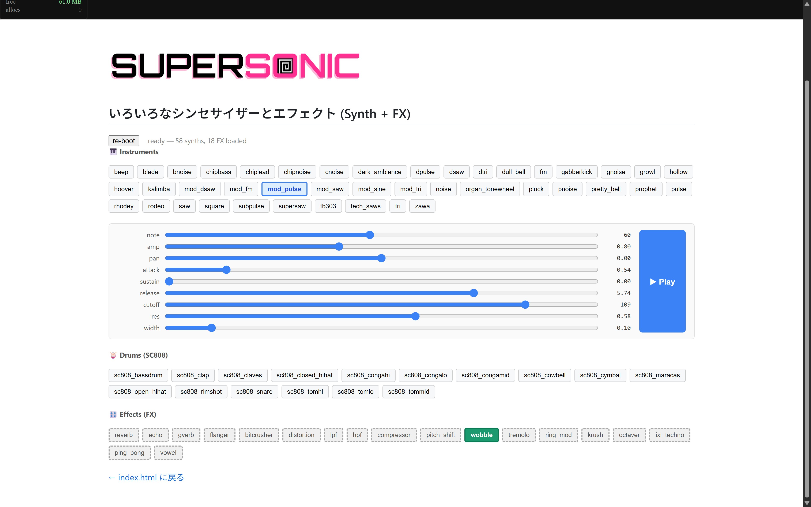

<style>
section {
  font-family: 'Hiragino Sans W4';
  color: #444;
  font-size: 24px;
}
b, strong {
  font-family: 'Hiragino Sans W7';
}
ol {
  list-style-type: decimal;
}
h1, h2, h3, h4, h5, h6{
  font-family: 'Hiragino Sans W7';
  color: #2277cc;
}
pre, code {
  font-family: 'JetBrains Mono Slashed', 'Noto Sans JP';
  line-height: 1.3;
}
</style>

##### AMCJワークショップ<br>共鳴するコード、SuperColliderで創る音の世界 - 実践とその先へ

# 04.<br>その先 3: WebブラウザーでSuperColliderを動かす!<br>SuperSonic

2026年3月14日
田所淳

---

## SuperSonicとは？


---

## SuperSonicとは？


SuperSonicは、SuperColliderの強力なオーディオ合成エンジンであるscsynthを、AudioWorkletとしてブラウザ上で動作させるプロジェクト
**→ つまりWebブラウザ上でSuperColliderのコードを実行できる!**

[Sonic Pi](https://sonic-pi.net/)の開発者としても知られるSam Aaron氏が中心となって開発

---

## SuperSonicとは？

まずはデモを試してみよう!

https://sonic-pi.net/supersonic/demo.html
すごい!!



---

# SuperSonicセットアップ

---

## SuperSonicセットアップ


今回は、ローカル環境にVSCodeからhttpサーバーを起動してSuperSonicを動かす方法を紹介します

まずは、VScodeの拡張機能「Live Server」をインストール
- VSCodeの拡張機能から「Live Server」を検索してインストール
- インストール後、VSCodeの右下に「Go Live」というボタンが表示される

---

## SuperSonicセットアップ

いよいよ、SuperSonicをセットアップしていきましょう!
SuperSonicを動かす方法は3つ。

1. CDN: クイックな実験、プロトタイプ、導入
2. npm: バンドラーを使用したJavaScriptプロジェクト
3. セルフホスト: 完全な制御、オフライン利用、本番環境へのデプロイ

Live Serverだと、CDNとnpmがなぜかうまくいかない…
今回はセルフホストでセットアップしてみましょう!

---

## SuperSonicセットアップ

1. SuperSonicのGihthubのリリースページから最新のリリースをダウンロード
https://github.com/samaaron/supersonic/releases
2. ダウンロードしたzipファイルを解凍した「supersonic」フォルダを今回のワークショップのサンプルファイルの「supersonic-examples」フォルダ以下に移動

- AMCJ26
  - supersonic-examples
    - index.html
    - synth.html
    - simple.html
    - supersonic (ここに解凍したsupersonicフォルダを移動)

---

## SuperSonicセットアップ

simple.htmlをブラウザで開いてみましょう!

bootボタンを押した後、triggerボタンを押す
→ シンセサイザー (Prophet 5) の音が再生される!



これでSuperSonicのセットアップは完了です!

---

## SuperSonicクィックスタート

まずは、simple.htmlを理解してみましょう!

``<script type="module">``から``</script>``までが重要な部分です

---

## SuperSonicクィックスタート

まず前半部分

```javascript
<script type="module">
      // SuperSonic モジュールをローカルファイルからインポート
      import { SuperSonic } from "./supersonic/supersonic.js";

      // SuperSonic インスタンスを生成
      // baseURL: SuperSonic 本体ファイルの場所
      // synthdefBaseURL: SynthDef（音色定義ファイル）の場所
      const supersonic = new SuperSonic({
        baseURL: "./supersonic/",
        synthdefBaseURL: "./supersonic/synthdefs/",
      });
```
SuperSonicクラスをsupersonic.jsからインポートして、Supersonicのインスタンスを生成しています

---

## SuperSonicクィックスタート

つづき

```javascript
// ボタン要素を取得
const bootBtn = document.getElementById("boot-btn");
const trigBtn = document.getElementById("trig-btn");

// boot ボタン: SuperCollider サーバーを起動し SynthDef を読み込む
bootBtn.onclick = async () => {
  await supersonic.init();                           // SuperCollider サーバーを非同期で起動
  await supersonic.loadSynthDef("sonic-pi-prophet"); // prophet シンセの SynthDef を読み込む
  // Metrics コンポーネントを SuperSonic に接続し、10fps でサーバー状態を更新
  document.getElementById("metrics").connect(supersonic, { refreshRate: 10 });
};
```
ここでは、bootボタンをクリックしたときの処理を定義しています

---

## SuperSonicクィックスタート

つづき

```javascript
  // trigger ボタン: OSC メッセージ /s_new でシンセを鳴らす
  // 引数: SynthDef名, ノードID(-1=自動), addAction, targetID, パラメータ...
  // note:52(ミ4), release:8(秒), cutoff:70(フィルターカットオフ)
  trigBtn.onclick = () => {
    supersonic.send("/s_new", "sonic-pi-prophet", 
      -1, 0, 0, "note", 52, "release", 8, "cutoff", 70);
  };
</script>
```

triggerボタンをクリックで、OSCメッセージ/s_newを送信して、
sonic-pi-prophetというSynthDefを鳴らすようにしています

---

## 別のSynthDefを鳴らしてみよう!

先程のソースの「sonic-pi-prophet」を別のSynthDefの名称に変更すると別のシンセを演奏できる

では、どのようなSynthDefがあるのか?
supersonic/synthdefs/以下に定義されている

```bash
sonic-pi-beep.scsyndef
sonic-pi-blade.scsyndef
sonic-pi-bnoise.scsyndef
...
```
では、この中から、sonic-pi-tb303.scsyndefを鳴らしてみましょう!

---
 
## 別のSynthDefを鳴らしてみよう!

変更する場所は2箇所

```javascript
...(中略)...
bootBtn.onclick = async () => {
  await supersonic.init();
  // ここを変更 sonic-pi-prophet → sonic-pi-tb303
  await supersonic.loadSynthDef("sonic-pi-tb303"); 
  document.getElementById("metrics").connect(supersonic, { refreshRate: 10 });
};

trigBtn.onclick = () => {
  // ここを変更 sonic-pi-prophet → sonic-pi-tb303
  supersonic.send("/s_new", "sonic-pi-tb303", -1, 0, 0, "note", 40, "release", 8, "cutoff", 90);
};
...(中略)...
```

音色が変化したはず!

---

### GUIを作ってみよう!

Webブラウザに搭載されているGUIコンポーネントで、簡単なGUIを実現
SynthDefへ ``/n_set`` メッセージを送出して、リアルタイムにパラメータを変更
詳細はソースコードを参照 ``gui-example.html``



---

### シンセサイザー一覧

使用できるシンセサイザーの音を確認できるデモを作成しました!



---

# SuperSonicのシンセイサイザーを自作する

---

## SuperSonicのシンセイサイザーを自作する

SuperSonicのSynthDefは、SuperCollider用に作成したSynthDefをそのまま利用できる!

1箇所のみ修正

```cpp
SynthDef("synthName",
  {
    // SynthDefの内容をここに記述
    ....
  }
).writeDefFile; // ここだけ変更 .add → .writeDefFile
```

writeDefFile()を呼び出すと、SynthDefがscsyndefファイルを生成
``(SCのUser Supportフォルダ)/synthdef/synthName.scsyndef`` に保存される

---

## SuperSonicのシンセイサイザーを自作する

まずは、簡単なサイン波のSynthDefを作成してみましょう

```cpp
SynthDef("simple-sine", {
    arg note = 60, amp = 1, pan = 0, out_bus = 0;
    var freq = note.midicps;
    var snd = SinOsc.ar(freq) * EnvGen.kr(Env.perc(), doneAction: Done.freeSelf);
    Out.ar(out_bus, Pan2.ar(snd * amp, pan));
}).writeDefFile;
```
ポイント:
- SynthDefの最後が.writeDefFileになっていること
- 引数に、note, amp, pan, out_busなど、必要なパラメーターを定義


---

## SuperSonicのシンセイサイザーを自作する

保存されたファイルを、Supersonicのsynthdefsフォルダにコピー

- 元: ``(User Suppoirtフォルダ)/synthdef/simple-sine.scsyndef``
- 先: ``supersonic/synthdefs/simple-sine.scsyndef``

---

## SuperSonicのシンセイサイザーを自作する

あとは、simple.htmlのソースコードを変更して、mySynthを鳴らすようにすればOK!

```javascript
bootBtn.onclick = async () => {
  await supersonic.init();
  // ここを変更 sonic-pi-prophet → mySynth
  await supersonic.loadSynthDef("simple-sine");
  document.getElementById("metrics").connect(supersonic, { refreshRate: 10 });
};

trigBtn.onclick = () => {
  // ここを変更 sonic-pi-prophet → mySynth
  supersonic.send("/s_new", "simple-sine", -1, 0, 0, "note", 40, "release", 8, "cutoff", 90);
};
```
---

## SuperSonicのシンセイサイザーを自作する

以前作成した "mySynth" をSupersonic用に書き換えてみましょう!
- argにnote, amp, pan, outを追加
- エンベロープをEnv.perc()に変更

```cpp
SynthDef("mySynth",{
    arg note = 60, amp = 1, pan = 0, out = 0, gate = 1, attack = 0.01, release = 1.0, detune = 1.005, cutoff = 1200, cutfreq = 1.0;
    var freq, sig, cutsig, env;
    freq = note.midicps;
    sig = Mix.ar([
      Saw.ar([freq / detune, freq * detune]) 
      , Saw.ar([freq / detune, freq * detune] / detune)
      , Saw.ar([freq / detune, freq * detune] / detune / 2.0)
    ]) / 3.0;
    env = EnvGen.kr(Env.perc(attack, release), gate, doneAction: 2);
    sig = sig * env * amp;
    cutsig = LFNoise2.kr([cutfreq, cutfreq * 1.5]).range(cutoff * 0.25, cutoff * 1.5);
    sig = MoogFF.ar(sig, cutsig, mul: 2.0);
    sig = GVerb.ar(sig, 100, 1.0);
    Out.ar(out, sig);
}).writeDefFile;
```

---

## SuperSonicのシンセイサイザーを自作する

呼び出し側のJavaScriptを変更
- SynthDef名を "mySynth" に変更
- note, release, cutoffなど、mySynthの引数に合わせて変更

```javascript
  // ...中略...
  bootBtn.onclick = async () => {
    await supersonic.init();
    await supersonic.loadSynthDef("mySynth");
    document.getElementById("metrics").connect(supersonic, { refreshRate: 10 });
  };
  trigBtn.onclick = () => {
  supersonic.send("/s_new", "mySynth", -1, 0, 0, "note", 40, "release", 5);
};
```

---

## SuperSonicのシンセイサイザーを自作する

あとは、いろいろ工夫次第で無限の可能性が!

- Webブラウザ上で動作するモジュラーシンセサイザー
- p5.jsなどのグラフィックライブラリと組み合わせて、ビジュアルと連動するシンセサイザー
- オーディオビジュアルパフォーマンスシステム

...etc.

---

## SuperSonicのシンセイサイザーを自作する

いろいろ機能を詰め込んだサンプル作ってみました!
→ synth-fx.html



---

## まとめ

- SuperSonicは、Webブラウザ上でSuperColliderを動かすプロジェクト
- SynthDefをブラウザ上で読み込んで、OSCメッセージでシンセを鳴らすことができる
- 自作のSynthDefも簡単に利用できる
- WebブラウザのGUIやグラフィックライブラリと組み合わせて、様々な表現が可能
- ぜひ、いろいろ試してみてください!

---

# おつかれさまでした!